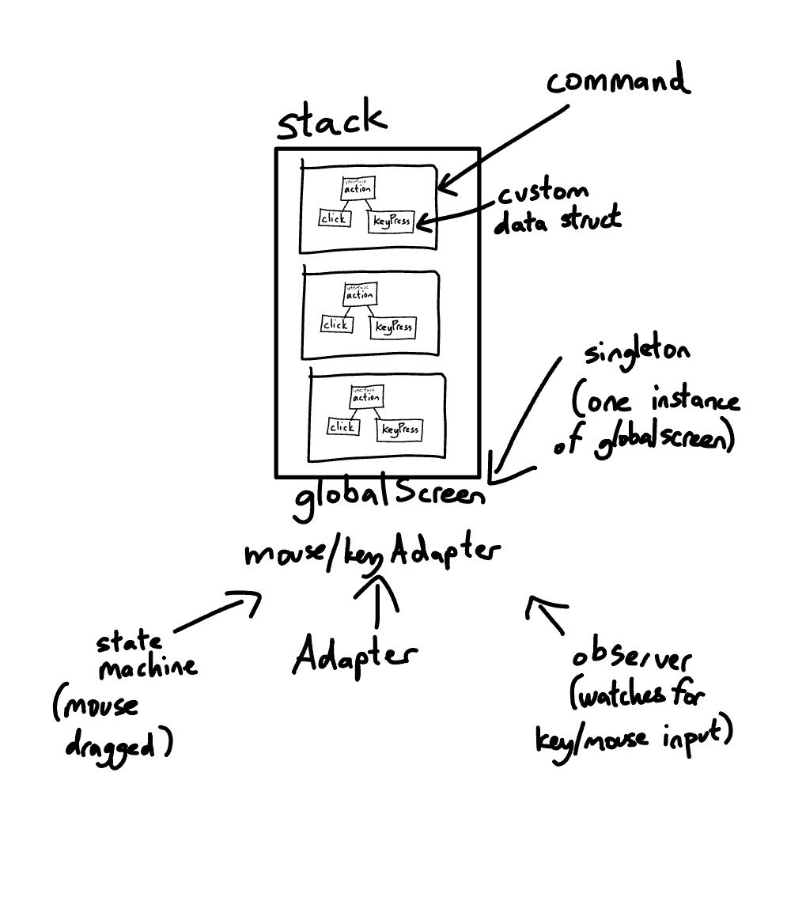

# Macro Maker 
### Description
The Macro project was my final project for Java Data Structures (H) in 10th grade, of which the requirements can be found <a href="https://docs.google.com/document/d/1YyRJAjr6AHJwiUSStHezJ4-zOyjFD9SiHnrGyFUSEps/edit#heading=h.ulg8gjex5xs6">**here**</a>. The final product allows the user to start and end a global recording of all inputs to the computer. The global recording will inputs including mouse movements; mouse dragging; mouse clicking, releasing, and holding; key presses, releases, and hold times; and any simultaneous combination of events. The actions are also logged in the logger.out file. After the user begins recording, (CTRL + SHIFT+ R), all henceforth input actions are recorded until the user stops recording (CTRL + SHIFT + S). Upon replaying, the program will execute the actions exactly as recorded. The press() methods also delays the action's execution as to match the delays between actions of the original recording. The program does not interfere with input actions or other applications in any way.

### Method

The main library that enabled the creation of this project is <a href="https://github.com/kwhat/jnativehook">**JNativeHook**</a>, which allows the global tracking of all actions that are sent into a computer, as opposed to only being able to detect inputs inside a specific window. In this project, JNativeHook's GlobalScreen and adapters were used, but I have overriden the action listeners and adapters with my own code to suit the needs of this project, specifically storage and replaying of inputs. 

When the program is running and recording is true (the user has started recording), every input action triggers a specific handler method which is able to encapsulate the event as an object to store in the recordedActions stack. During recording, a global variable of time is used to keep track of delays between actions. Every time a new action is recorded, the variable is then updated to the time in milliseconds when the action was performed. When the next action is then recorded, subtracting the last recorded time from the current system time gives us the delay, which is stored as part of the action object. Then, the time variable is updated. Thus, we are able to track the delays between actions in order to replay them at the right times. 

The different action classes (ClickPress, ClickRelease, KeyPress, KeyRelease, MouseMove) allow the program to store every input as an individual object. All these classes implement the Action interface, giving them all a press() method which is called when replaying.

The other adapter and conversion classes (SwingKeyAdapter, MouseCoordinateConverter, KeyLocationLookup, KeyCursorLookup) allow for conversion between different keycodes and screen sizes. The SwingKeyAdapter, KeyLocationLookup, and KeyCursorLookup classes convert VC keycodes used by NativeKeyEvent into VK keycodes used by KeyEvent. The MouseCoordinateConverter class allows for conversion between physical mouse cursor coordinate positions and scaled mouse cursor coordinate positions, allowing MouseMove to move the cursor to the corrent point for all screen sizes on different computers.

During recording, all input actions are created as new objects of their respective class and are stored in a stack until the user stops. Upon replaying the stored actions, the program will iterate through the stack and call each object's press() method to execute the action exactly as performed. 

  

### Download 

##### The github repo can be found <a href="https://github.com/richard-shan/macro">here</a>.
##### The jar executable can be downloaded <a href="../macro.jar" download="Macro Maker.jar">here</a>.
 

##### Instructions for Use

Start Recording Keystrokes: CTRL + SHIFT + R

Stop Recording Keystrokes and Save: CTRL + SHIFT + S

Replay Saved Keystroke Sequence: CTRL + SHIFT + 1

   

### Initial Planning Chart

##### Key Elements
- Action interface implemented by all the action/event classes: ClickPress, ClickRelease, KeyPress, KeyRelease, MouseMove, etc.
    - Every action class follows the command archetype, allowing the encapsulation of a request as an object.
- KeyLocationLookup 
    - Singleton - single instance of the lookup object that is referenced every time a key conversion is needed
    - Hashtable inside KeyLocationLookup to store NativeKeyEvent KeyLocations and corresponding KeyEvent integer values for conversion
- Mouse and Keyboard Adapters to listen for actions within the global screen. Those adapters also function as observers for the GlobalScreen.
- Stack to store the recorded actions
- Custom MouseCoordinatesConverter component that will convert true x,y mouse coordinates to relative x, y mouse coordinates scaled to each computer's unique screen size. Also functions as an adapter.
- State machine under GUILogger handling action transitions and entries when a key/mouse is pressed
- TreeMap under KeyCursorLookup to store NativeKeyEvent VC values and corresponding KeyEvent VK values

